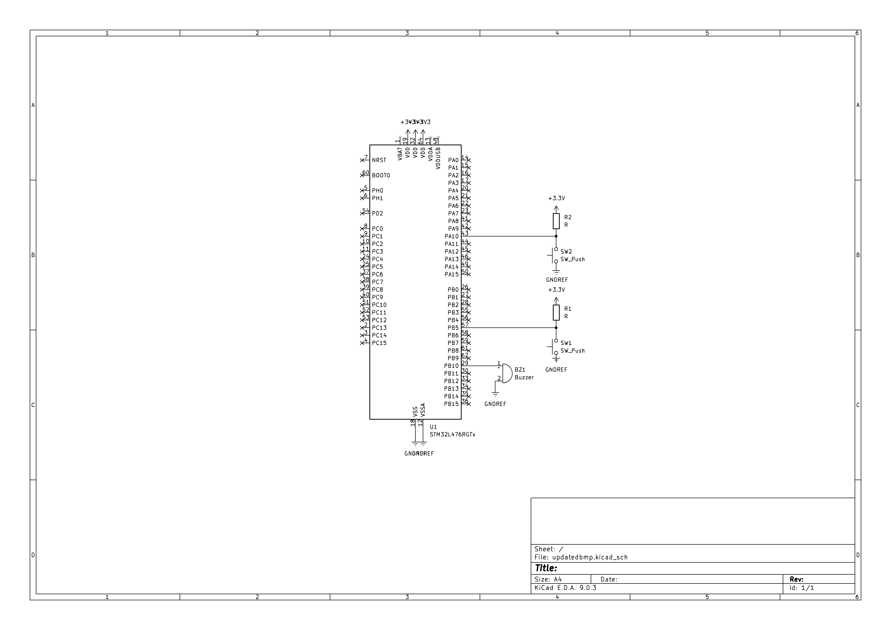

# STM32 PWM Buzzer Music Player

This project implements a music player on an STM32 microcontroller using hardware PWM to drive a passive buzzer. Musical notes are generated by configuring a timer’s auto-reload register (ARR) to produce precise square-wave frequencies. The system supports real-time pitch shifting using external interrupts.

---

## Hardware Components

- STM32 development board (NUCLEO-L476RG)
- Passive buzzer  
  - Connected to **TIM2 Channel 3 PWM output**
- Two push buttons  
  - **PB5**: Pitch up  
  - **PA10**: Pitch down
- Jumper wires

---
## Timer Configuration (TIM2, 32-bit resolution)
- PSC: 4
- Counter mode: Up
- PWM mode: PWM1
- Channel: TIM2_CH3
- CLK source: PLL-derived system clock

## System Overview

### Sound Generation (PWM)

- Uses **TIM2 PWM** to generate square waves
- Each note frequency is produced by updating the timer period (ARR), where ARR = (timer CLK/frequency) - 1
- Duty cycle (CCR) controls volume
  
### Melody Representation
- static const float frequencies[] stores note frequencies in Hz
- static const float durations[] stores note lengths in milliseconds

### Button Inputs (EXTI)
- PB5 increments pitch (upCount++)
- PA10 decrements pitch (downCount++)
- Pitches are shifted by one semitone: f_shifted = f_base × 2^(n / 12), where n = upCount - downCount
- 50 ms debounce window implemented to reduce input noise

### Playback 
For each note, the program will:
1. Apply pitch multiplier
2. Compute PWM frequency (ARR)
3. Set duty cycle (volume)
4. Start PWM output
5. Delay for note duration
6. Stop PWM

